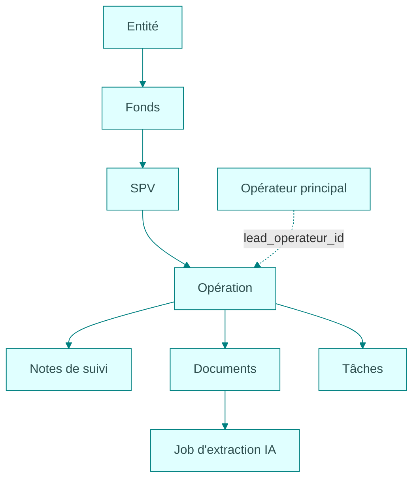

Une clé API donne accès au contexte d'une **entité MARKO**. Elle ne permet pas de choisir librement une autre entité dans un paramètre. Ses scopes et restrictions déterminent ensuite les actions possibles.

## Le modèle métier

Le schéma montre les rattachements usuels. Certains champs de liaison sont facultatifs : consulter les champs obligatoires de la route utilisée. Un utilisateur, un deal ou une ressource non rattachée restent soumis au contexte de l'entité.

| Ressource | Rôle | Liaison utile |
| --- | --- | --- |
| Fonds | Structure d'investissement regroupant des SPV. | Une SPV peut porter un `fond_id`. |
| SPV | Société qui porte une ou plusieurs opérations. | Une opération peut porter un `spv_id`. |
| Opérateur | Société ou acteur responsable d'une opération. | `lead_operateur_id` identifie l'opérateur principal. |
| Deal | Dossier du pipeline CRM avant closing. | Ses statuts et ses notes sont propres au pipeline deals. |
| Opération | Dossier d'investissement suivi dans MARKO. | Notes, documents et indicateurs s'y rapportent. |
| Document | Fiche, fichier disponible et rattachement métier. | L'upload externe exige une opération. |
| Job | Traitement différé d'un import ou d'un document. | Son identifiant sert au suivi, pas à identifier une opération. |

Un **opérateur** est une ressource métier. Un **utilisateur** est un compte avec un rôle dans l'entité. Leurs identifiants ne sont pas interchangeables.

## Deux identifiants pour une synchronisation

`external_id` est l'identifiant que votre application connaît déjà, par exemple une référence CRM. `marko_id` est l'UUID renvoyé par MARKO après résolution ou création.

Conservez leur association dans votre application. Une opération renommée garde son identité; son nom n'est pas une clé de synchronisation. L'association externe dépend de l'entité, de l'intégration cliente, de l'environnement et du type de ressource.

Les routes ordinaires utilisent généralement l'UUID MARKO. Les routes `/external/...` utilisent votre référence. Tous les identifiants utilisateur et workflow ne sont pas des UUID : la référence indique leur type.

## Les statuts ne désignent pas tous la même chose

| Champ ou ressource | Question à laquelle il répond |
| --- | --- |
| Statut d'opération | Où se trouve le dossier dans son cycle métier ? |
| Statut de deal | Où se trouve le dossier avant closing ? |
| Statut de job | Le traitement est-il en attente, en cours ou terminé ? |
| Résultat d'upsert `outcome` | La ressource a-t-elle été créée, modifiée, restaurée ou retrouvée sans changement ? |
| État de document | Quel est son état de traitement ou de validation ? |

Un job terminé peut contenir des erreurs ou des suggestions encore à valider. Pour les imports, lire les résultats individuels. Pour l'IA, lire les compteurs et les résultats disponibles.

Pour commencer une synchronisation, suivre le tutoriel [CRM vers MARKO](/tutorials/crm-sync).
